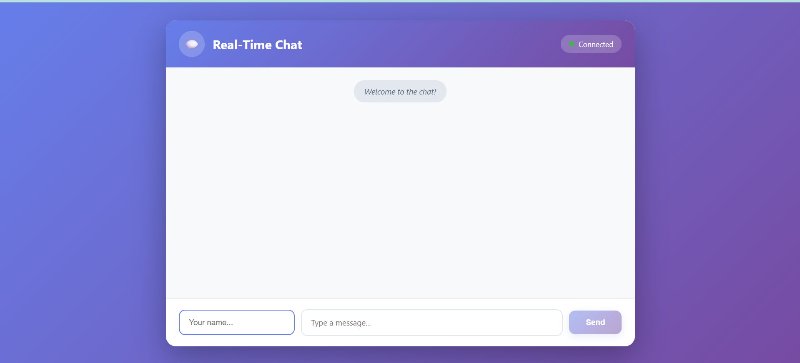
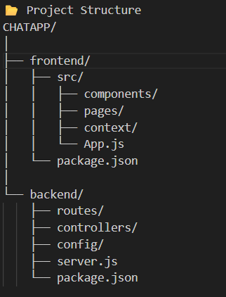

# 📱 ChitChat — Real-Time MERN Chat Application

## A fully responsive real-time chat app built using the MERN Stack (MongoDB, Express, React, Node) along with Socket.io for instant messaging.
ChitChat provides a smooth chatting experience with typing indicators, online user status, and fast message delivery.

## 🎥 Live Demo / Preview

[(Website link)](https://chat-app-phi-five-91.vercel.app/)

      

🚀 Features

⚡ Real-time chat using Socket.io

👥 User authentication (JWT-based if added)

📡 Online/offline user status

✍️ Typing indicators

💬 Private & group chats (if included)

📁 MongoDB database for users & messages

🎨 Clean & responsive React UI

🌐 REST API + WebSocket

🔒 Secure Express backend

📱 Mobile-friendly layout

🛠️ Tech Stack
Frontend

React.js

React Router

Context API / Redux (optional)

CSS / Tailwind / Material UI

Backend

Node.js

Express.js

Socket.io

▶️ Installation & Setup  
1️⃣ Clone the Repository 
git clone <repo-url> 
cd ChitChat 

2️⃣ Backend Setup 
cd server 
npm install 

Create a .env file: 

PORT=5000

Start backend:

npm run dev

3️⃣ Frontend Setup 
cd ../client 
npm install 
npm start 

🔌 How It Works

Express handles APIs

Socket.io creates a WebSocket connection for real-time messaging

React updates chats instantly

📸 Screenshots

🤝 Contributing

Contributions, issues, and feature requests are welcome!

⭐ Show Your Support

If you like this project, please star ⭐ the repository — it motivates me to build more!

